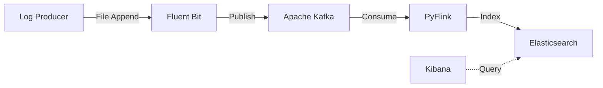

# Distributed Log Aggregation Pipeline

A production grade, distributed stream processing and log aggregation pipeline. This project simulates a real-world enterprise observability architecture ( similar to how Netflix or Uber run at scale) that collects logs from multiple microservices, buffers them, processes them in real-time to drop noise and enrich data, and finally makes them searchable via a dashboard.

---

##  Architecture & Data Flow

The entire pipeline is fully containerized using Docker and communicates over a custom internal bridge network. The architecture consists of 6 core components moving data in a unidirectional flow:



### 1. Log Producer (`producers/simulate_logs.py`)
A Python application that infinitely generates structured JSON logs. It simulates traffic across various microservices (`auth-service`, `payment-service`, etc.), generating timestamps, trace IDs, and different log levels (`INFO`, `DEBUG`, `ERROR`). It writes these directly to a shared `logs/app.log` file.

### 2. Log Collector (Fluent Bit)
A highly efficient C-based log forwarder. It uses a `tail` plugin to instantly detect new lines appended to `app.log`. It wraps the raw logs and forwards them over the network directly into our message broker.

### 3. Message Broker (Apache Kafka)
Kafka acts as the massive, scalable buffer for the system. It receives the high-throughput firehose of logs from Fluent Bit and stores them in the `raw-events` topic. Kafka decouples the producers from the consumers, ensuring that if the downstream processing crashes, no logs are ever lost.

### 4. Stream Processor (PyFlink)
The brain of the operation (`jobs/enrichment_job.py`). It connects to Kafka as a consumer, streaming events in real-time. It acts as an ETL (Extract, Transform, Load) worker:
- **Filtering:** It actively drops any log with a `DEBUG` level, preventing "noise" from eating up expensive downstream database storage.
- **Enrichment:** It mutates the JSON data by injecting an `"enriched": true` flag into every record.
- **Sinking:** It maps over the final stream and pushes the structured documents to Elasticsearch.

### 5. Storage (Elasticsearch 8.x)
A high-performance NoSQL database built on top of Apache Lucene. It stores the final, enriched JSON logs in the `flink-enriched-logs` index, creating inverted indices for lightning-fast full-text search.

### 6. Visualization (Kibana)
The web interface connected to Elasticsearch. It allows users to create Data Views, build dashboards, and search through billions of log lines in milliseconds using KQL (Kibana Query Language).

---

##  Current Design

## Current Design Decisions

The pipeline is intentionally designed around several core architectural principles to ensure scalability, fault-tolerance, and efficiency:

1. **Decoupled Architecture:** 
   By placing Apache Kafka between the log collectors (Fluent Bit) and the stream processor (PyFlink), the system achieves true decoupling. If the downstream database goes offline, or if the stream processor needs to be restarted for an update, the application servers are completely unaffected. Kafka acts as a durable shock absorber, buffering the data until the downstream systems are ready to consume it again.

2. **Lightweight Edge Collection:**
   Instead of using a heavy, JVM-based collector like Logstash, this design utilizes Fluent Bit. Written in C, it consumes mere megabytes of memory. It sits directly alongside the application containers, passively tailing the log files with virtually zero overhead to the host machine.

3. **Compute Push-Down (Pre-Processing):**
   A naive log pipeline dumps all raw data directly into a database. This design uses PyFlink to perform Extract, Transform, Load (ETL) operations *in-flight*. By actively filtering out `DEBUG` logs before they reach storage, the pipeline drastically reduces downstream storage costs, network bandwidth, and database index bloat.

4. **The Append-Only Immutable Log:**
   Kafka treats log events as an append-only, ordered sequence of immutable records. This provides strict ordering guarantees and allows multiple independent consumer groups to read the same stream of logs at different speeds without interfering with one another.

5. **Inverted Indexing for Search:**
   Logs are inherently semi-structured text data. Relational databases (SQL) are notoriously slow at full-text search across billions of rows. This architecture uses Elasticsearch, a NoSQL datastore that builds an inverted index under the hood. This ensures that searching for a specific `trace_id` across millions of logs returns results in milliseconds.

---

## Limitations of the Current Design

While this pipeline proves the end-to-end architecture, it makes several trade-offs for the sake of local demonstration:

1. **Single Node Failures:** Kafka and Elasticsearch are running as single nodes (`discovery.type=single-node`). In production, these must run as distributed clusters with replication factors > 1 to ensure high availability.
2. **Direct Python Map Sinking:** Using a native Python `map()` function to open an Elasticsearch HTTP connection for *every single record* in PyFlink is an anti-pattern. In production, this creates massive connection overhead. A true production system uses bulk-indexing (flushing batches of 1000+ records) via the official Java-backed Sink connectors.
3. **Missing Schema Validation:** The pipeline relies heavily on Python `try/except` blocks to handle malformed JSON. A production pipeline would enforce strict schemas using a Schema Registry (like Avro or Protobuf) before events even enter Kafka.
4. **No Authentication:** We explicitly disabled passwords (`xpack.security.enabled=false`) and Kafka ACLs. Production environments require mTLS for Kafka and RBAC/API keys for Elasticsearch.
5. **No Tiered Storage:** Logs are kept infinitely in Elasticsearch's hot storage until disk space runs out. A real system would use Index Lifecycle Management (ILM) to roll old logs into cheaper cold storage (like Amazon S3).

---

## How to Run It

1. **Start the Infrastructure:**
   ```bash
   docker compose up -d
   ```
2. **View the Logs:**
   Navigate to [http://localhost:5601](http://localhost:5601).
3. **Configure Kibana:**
   - Go to **Stack Management** > **Data Views**.
   - Create a new Data View with the Index pattern: `flink-enriched-logs*`.
   - Select `@timestamp` as the timestamp field.
4. **Tear Down:**
   ```bash
   docker compose down
   ```
